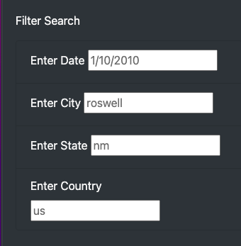
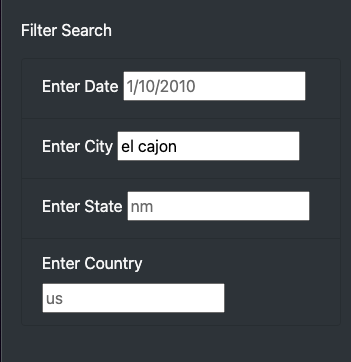
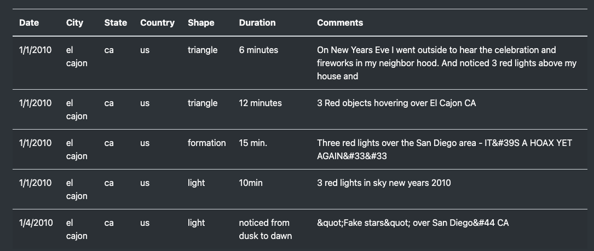

# UFO visualization with JavaScript

---
## Overview

Using JavaScript as the primary coding language, I created a table to organize UFO data stored as an array. I was able to create, populate and dynamically filter the table based on certain criteria using JavaScript and HTML. 

---
### Resources:
* Source Code: [Challenge Script]()
* Source Data: [MechaCar MPG]()
* Technology: [Javascript](), [HTML](),[CSS]()

---
### Deliverables:
- [x] Deliverable 1: Filter UFO sightings on multiple criteria
- [x] Deliverable 2: Summary Analysis 

---
### Filter Sightings 
In order to use the new filter search features we must scroll to the 'Filter Search' section on the left side of out index.html site.

From there the user is able to select one or more criteria to filter the UFO Sighting table. The data points are; Date, City, State (abbreviated) and Country (abbreviated).

Once one or more data points are entered in the filter search section the user must click somewhere outside of the boxes for the table on the right side to update.

The table with automatically update showing all data that matches the filter search criteria.

This updated table displays all results for 'el cajon'. The table now shows 5 rows with sightings in El Cajon, CA.

---
### Summary 

Overall this is a great starting point to increase the general public's awareness of potential UFO sightings. One drawback of the site is the lack of credibility, ideally W. Avy would provide a link to the data and an explanation of how the data is collected and validatated.

The user experience could be enhanced by updating the filter search criteria to adjust for lower case or upper case characters. Additionally a 'filter now' button could be added so the user cleary knows how to click and update the table with the desired results.
